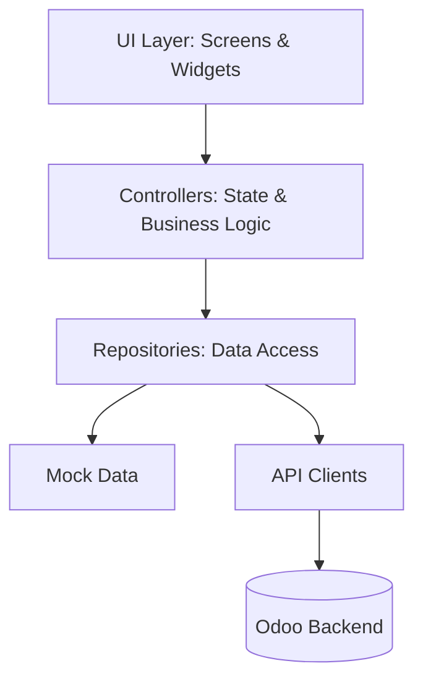

# Architecture

The ZConnect mobile app uses a modular directory structure built around the **GetX** ecosystem for state management, routing, and dependency injection.

## High-Level Architecture

The architecture separates UI components (Screens/Widgets), Business Logic (Controllers), Data Models, and Services (Repositories/API Clients).



## Folder Structure

```
lib/
├── core/                   # Global configuration, themes, colors, and constants
├── features/               # Feature-based modules
│   ├── auth/               # Login and Signup
│   ├── customer/           # Customer-specific screens and controllers
│   ├── driver/             # Driver-specific screens and controllers
│   └── shared/             # Shared models, widgets, and services
└── main.dart               # App entry point
```

## State Management and Routing
- **GetX** is used extensively. Controllers (e.g., `NewShipmentController`, `DriverJobsController`) hold observable state (`Rx` types) and are bound to screens.
- **Routing** is handled via `Get.to()`, `Get.off()`, and named routes where applicable.

## Services and Mock Boundaries
- Data fetching is routed through Repositories (e.g., `ShipmentRepository`).
- Currently, many data calls fall back to `mock_data.dart` because the actual API endpoints are still under development. Mocks simulate network latency to test UI loading states.
