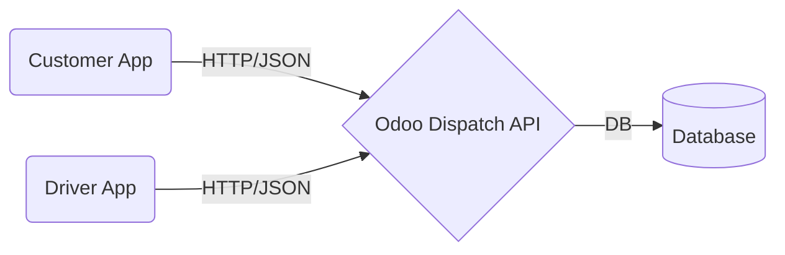

# Platform Overview

ZConnect is a modern parcel delivery and logistics platform designed to connect customers with drivers efficiently. 

This repository contains the **Mobile Application** source code, which serves both user groups through role-based access.

## Ecosystem Context

The ZConnect platform consists of:
1. **The Mobile App (This Repo)**: Flutter-based interface for Customers and Drivers.
2. **The Backend / Dispatch Server**: An Odoo-based backend that manages fleets, pricing rules, job dispatching, and user accounts.

## Workflows
- **Customers** create shipments via the app. The backend calculates pricing and registers the shipment.
- **Dispatch** (Backend logic) assigns the shipment to an available driver based on vehicle type and location.
- **Drivers** receive the assignment, accept it, and update the status from Pickup to Delivery.

*Note: The actual Odoo integration is partially complete. Most data in the app is currently mocked for development purposes.*
